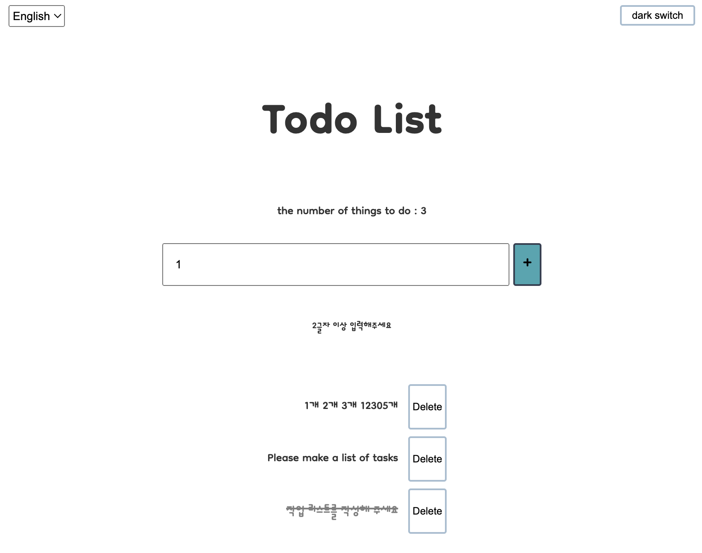
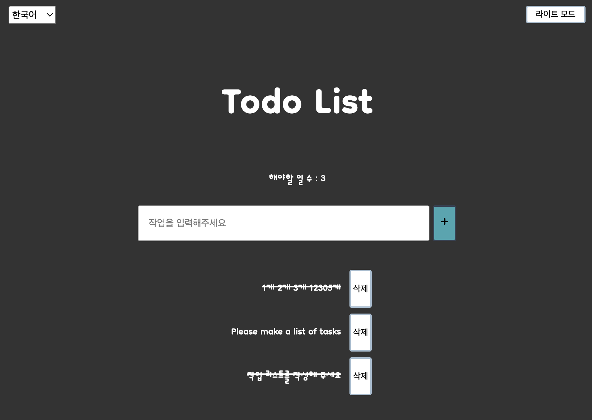

### React Hooks를 활용한 ToDoList를 만드는 프로젝트입니다.

---

- Hook을 사용하면서 공부하면서 배운 이론들을 몸소 느낄 수 있었던 프로젝트라고 생각한다.
- props Drilling이 어떤 것인지, 왜 이를 해결 하려 했는지 작은 규모이지만 필요성을 느꼈고 Context를 사용해보며 구조를 이해할 수 있었다.
- Styled Components 라이브러리를 적용하면서 많은 콘솔 경고 문구를 보았고 하나하나 해결하면서 react에서 어떤 구조의 코드를 좋아하는지 알 수 있었다.
- 경고 문구 중에서 Transient props를 적용을 권고해 적용해 보았고, Helmet을 적용해 Google fonts를 가져와 적용해 react가 메타테그를 어떤 식으로 관리하는지 알 수 있었다.

## 목표

- Dispatch에 Action을 담아 Reducer에게 보내며, Reducer가 state를 변경해 결과에 반영하는 구조를 가진 todolist 구현하기

#### 추가 목표

1. 국제화 버튼 디자인 적용하기

#### 구현 완료된 기능

1. 다크모드
2. 반응형
3. I18N 국제화
4. 일관성을 위한 디자인 theme 적용
   > 4-1. 구글 폰트 적용
5. Transient props 적용 완료
   > 5-1. 불필요한 내부 변수 DOM에 전달 안하기
6. react-hook-form 라이브러리 적용
   > 6-1. 유효성(validation) 검사 기능 적용

</img> 
</img> 
